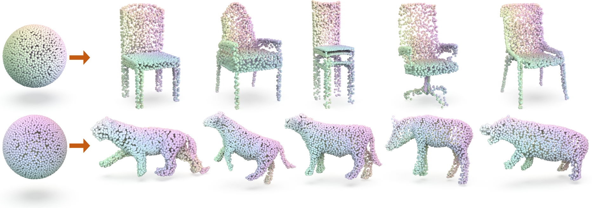

# SP-GAN: Sphere-Guided 3D Shape Generation and Manipulation (SIGGRAPH 2021)

This repository contains a Pytorch implementation of the paper:

[SP-GAN: Sphere-Guided 3D Shape Generation and Manipulation](https://liruihui.github.io/publication/SP-GAN/). 
<br>
[Ruihui Li](https://liruihui.github.io/), 
[Xianzhi Li](https://nini-lxz.github.io/),
[Ka-Hei Hui](https://appsrv.cse.cuhk.edu.hk/~khhui),
[Chi-Wing Fu](http://www.cse.cuhk.edu.hk/~cwfu/).
<br>
<br>



### Dependencies
* Python 3.6
* CUDA 10.0.
* [PyTorch](http://pytorch.org/). Codes are tested with version 1.2.0
* (Optional) [TensorboardX](https://www.tensorflow.org/) for visualization of the training process. 

Following is the suggested way to install these dependencies: 
```bash
# Create a new conda environment
conda create -n PointAugment python=3.6
conda activate PointAugment

# Install pytorch (please refer to the commend in the official website)
conda install pytorch=1.2.0 torchvision cudatoolkit=10.0 -c pytorch -y
```

### Usage
As a generation task, you can freely customize your own dataset, such as <a href="https://shapenet.org/" target="_blank"> ShapeNet </a>, <a href="https://smpl.is.tue.mpg.de/" target="_blank"> SMPL</a>, <a href="https://smal.is.tue.mpg.de/" target="_blank"> SMAL</a> 

Or directly download our prepared H5 Files from <a href="https://drive.google.com/file/d/1nf4evH838Qt2n8ypKVMtPHGJ7CD6b2-W/view?usp=sharing" target="_blank">here</a>. 

To train a model on point clouds sampled from 3D shapes:

    python train.py --choice Chair

Log files and network parameters will be saved to `log` folder in default. 

For your reference, the pretrained models are also available from <a href="https://drive.google.com/file/d/1AvnHDdR_N63ZGuakhaGkyk0EJPFzsvHR/view?usp=sharing" target="_blank">here</a>

We provide various visulization function for shape interpolation, part interpolation, and so on. 

    python visual.py

### Evaluation
Please ref to
<a href="https://github.com/optas/latent_3d_points" target="_blank">Latent-GAN</a>, <a href="https://github.com/stevenygd/PointFlow" target="_blank">PointFlow</a>, and <a href="https://github.com/fpthink/PDGN" target="_blank">PDGN</a>


### Citation
If you find our work useful in your research, please consider citing:
```
@article{li2021spgan,
  title={{SP-GAN}:Sphere-Guided 3D Shape Generation and Manipulation},
  author={Li, Ruihui and Li, Xianzhi and Hui, Ke-Hei and Fu, Chi-Wing},
  journal={ACM Transactions on Graphics (Proc. SIGGRAPH)},
  volume={40},
  number={4},
  year={2021},
  publisher={ACM}
}
```


